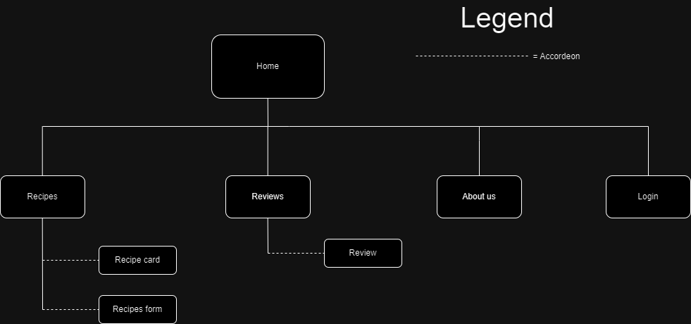
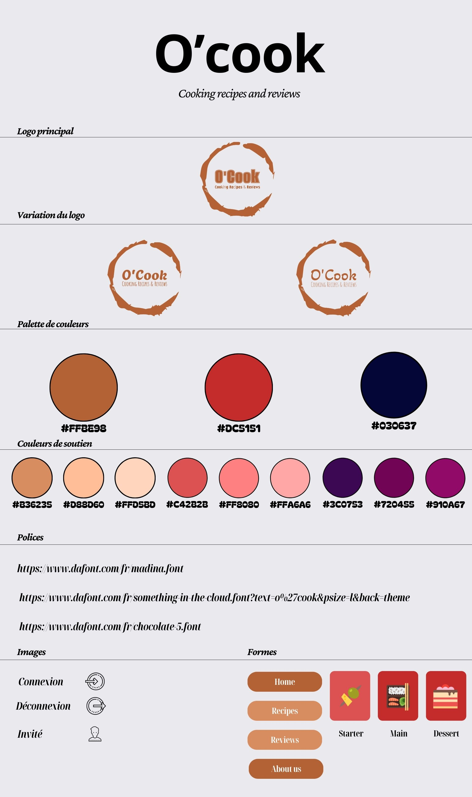

# Le cahier des charges

## Présentation du projet

Le site O’Cook est un blog tenu par un ou une foodie. Il propose un recueil exhaustif de recettes, ainsi que des reviews de restaurants visités par le propriétaire du blog. Les recettes compilées sur le site seront ajoutées par son propriétaire, et les utilisateurs connectés pourront eux aussi contribuer à l’ajout d’une ou plusieurs recettes, participant ainsi à l’émulation créative. Ce site est une commande d’une ou d’un passionné de gastronomie, voulant partager à d’autres passionnés ses expériences culinaires, à travers ses propres recettes et ses visites d’établissements.

## Définition des besoins et des objectifs

Définition des besoins principaux proposés par le site :

- Recherche de recettes
- Recherche d'établissements culinaires

Définition des objectifs principaux proposés par le site :

- Proposer des recettes
- Proposer des établissements culinaires

Accessibilité :

- Avoir un score d'accessibilité A minimum et idéalement AA

## Fonctionnalités du site O'Cook

Le MVP (Minimum Viable Product) :

- Page statique de l'accueil
- Page statique à propos
- Page statique des recettes
- Page statique des reviews

Les évolutions potentielles :

- Page de connexion et inscription
- Ouverture de la page recette en accordéon
- Ouverture du formulaire de recette en accordéon (publication après vérification du product owner)
- Ouverture de la page de review en accordéon
 - Ajout d'une barre de recherche
 - Affichage du contenu en fonction des filtres sélectionnés
 - Carrousel "Recettes de la semaine"

### v2

  - Ajout de commentaire sous les recettes (publication après vérification du product owner)
  - Ajout de commentaire sous les reviews (publication après vérification du product owner)
  - Ajout du darkmode
  - Mettre en favori certaines recettes (entrecôtes)
  - Ajout d'une fonctionnalité "lu" et "non lu"
  - Ajout d'un ou plusieurs minuteurs sous la liste d'ingrédients (Minuteur four, frigo, repos, cuisson, etc)
  - Ajouter un affichage simplifié pour les cards recette en version mobile, pour faciliter la lecture entre la TodoList et la liste d'ingrédients
  - Ajout d'une carte intéractive sur la page reviews
  - Ajout d'une page profil qui permettrait de :
    - Changer le pseudo
    - Changer de Mot de passe et de mail
    - Voir les commentaires écrits
    - Voir les recettes publiées
    - Voir les recettes mises en favoris

Listing des fonctionnalités principales du site :

- Identification/Inscription
- Visualisation de recettes et de reviews
- Soumettre une recette à l'auteur du site
- Possibilité de filtrer l'affichage en fonction des catégories

## Liste des technologies utilisées pour le site O'Cook

- Sass
- JavaScript
- Svelte
- Directus

## Public ciblé

 - Les passionnés de cuisine, ouvert à tout le monde quel que soit l’âge. 

## Les navigateurs compatibles

- Tous les navigateurs pourront être utilisés grâce à un reset.css
- Le site sera entièrement responsif :
  - Mobile : max 768
  - Desktop : min 769

## L'arborescence de l'application

## Routes

|          Page         |   URL        | HTTP Method |              Title                 |     Comment      |
| --------------------- | ------------ | ------------| ---------------------------------- | ---------------- |
|  Accueil              | /            |     GET     |   Page d'accueil                   |        -         |
|  Recipes              | /recipes     |     GET     |   Page recette                     |        -         |
|  Recipe               | /recipes/:id |     GET     |   Accordeon recette                |        -         |
|  Add recipe           | /recipe      |     POST    |   Formulaire d'ajout de recette    |        -         |
|  Reviews              | /reviews     |     GET     |   Page reviews                     |        -         |
|  Review               | /reviews/:id |     GET     |   Accordeon review                 |        -         |
|  About us             | /aboutus     |     GET     |   Page About us                    |        -         |
|  Newsletter           | /aboutus     |     POST    |   Inscription a la Newsletter      |        -         |
|  Contact              | /aboutus     |     POST    |   Formulaire de contact            |        -         | 
|  Login / Register     | /login       |     GET     |   Page de connection               |        -         |
|  Log in               | /login       |     POST    |   Formulaire de connection         |        -         |
|  Register             | /login       |     POST    |   Formulaire de création de compte |        -         |
|  Log out              | /logout      |     POST    |   Page de deconnexion              |        -         |
|  Not found            | *            |     GET     |   Page 404                         |        -         |

Dans le footer il y a les liens contact et legal notice qui nous ramenent vers la page about us directement sur la partie concernée.

Lorsqu'on clique sur une card recette dans la page d'accueil, il faut que le lien nous emmène sur la page /recipes et ouvre la recette concernée.

Lorsqu'on clique sur une card review dans la page d'accueil, il faut que le lien nous emmène sur la page /reviews et ouvre la review concernée.

## User stories

### Utilisateur non connecté

| En tant que | Je veux                                                | Afin de (si besoin/nécessaire)            |
|-------------|--------------------------------------------------------|------------------------------------------ |
| visiteur    | pouvoir faire une recherche par mot clé                | naviguer plus rapidement sur le site      |
| visiteur    | pouvoir naviguer d'une page à une autre                | naviguer facilement sur le site           |
| visiteur    | pouvoir visualiser les recettes                        |              -                            |
| visiteur    | pouvoir visualiser les reviews                         |              -                            |
| visiteur    | pouvoir filtrer les recettes par catégories            |              -                            |
| visiteur    | pouvoir accéder aux différents réseaux sociaux du site | visualiser les nouveautés                 |
| visiteur    | pouvoir m'authentifier                                 |              -                            |
| visiteur    | pouvoir créer un compte                                | pouvoir ajouter une ou plusieurs recettes |
| visiteur    | pouvoir contacter le propriétaire / admin du site      | prendre des renseignements / infos        |
| visiteur    | pouvoir m'inscrire à la newsletter                     | avoir les nouveautés                      |

### Utilisateur connecté

| En tant que           | Je veux                                        | Afin de (si besoin/nécessaire)      |
|-----------------------|------------------------------------------------|-------------------------------------|
| utilisateur connecté  | pouvoir me déconnecter au site                 |      -                              |
| utilisateur connecté  | pouvoir ajouter une recette via le formulaire  | partager ses recettes sur le site   |

### BackOffice

| En tant que | Je veux                                                                  | Afin de (si besoin/nécessaire)                    |
|-------------|--------------------------------------------------------------------------|---------------------------------------------------|
| superadmin  | pouvoir me déconnecter en tant qu'administrateur                         |      -                                            |
| superadmin  | pouvoir me connecter en tant qu'administrateur                           |      -                                            |
| superadmin  | pouvoir ajouter des reviews                                              |      -                                            |
| superadmin  | pouvoir modifier des reviews                                             |      -                                            |
| superadmin  | pouvoir supprimer des reviews                                            |      -                                            |
| superadmin  | pouvoir ajouter des recettes                                             |      -                                            |
| superadmin  | pouvoir modifier des recettes                                            |      -                                            |
| superadmin  | pouvoir supprimer des recettes                                           |      -                                            |
| superadmin  | pouvoir modifier le statut d' une recette                                |valider les recettes proposées par les utilisateurs|
| superadmin  | pouvoir valider / refuser la création de recette d'un compte utilisateur |      -                                            |
| superadmin  | pouvoir supprimer un compte utilisateur                                  |      -                                            |
| superadmin  | pouvoir envoyer la newsletter                                            |      -                                            |
| superadmin  | pouvoir ajouter des filtres                                              |      -                                            |
| superadmin  | pouvoir modifier des filtres                                             |      -                                            |
| superadmin  | pouvoir supprimer des filtres                                            |      -                                            |
| superadmin  | pouvoir ajouter un utilisateur (admin)                                   |ajout de modérateurs                               |
| superadmin  | pouvoir supprimer un utilisateur (admin)                                 |      -                                            |

## Liste des rôles

- Fanny A. : Lead Dev front
- Wendy A. : Scrum master et Référents techniques git
- Nicolas U. : Référent technique techno
- Paul L. : Lead Dev back
- Yohan D. A. : Lead Dev front
- Jordy H. : Product owner

- Front : Jordy H. , Fanny A. , Yohan D. A.
- Back : Wendy A. , Paul L. , Nicolas U.

## Charte graphique

